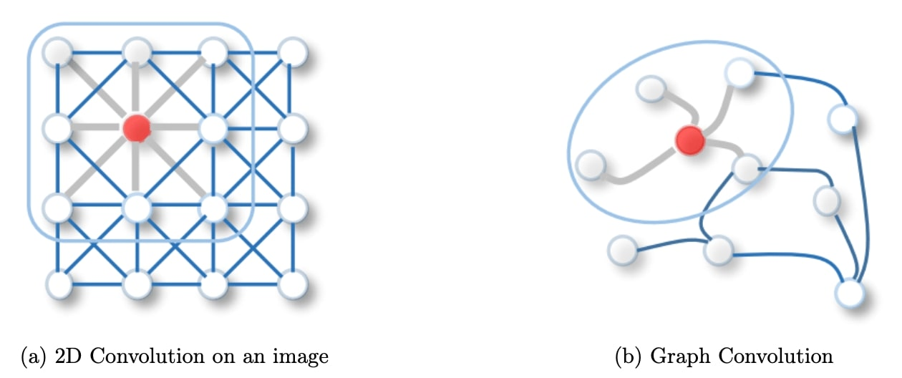
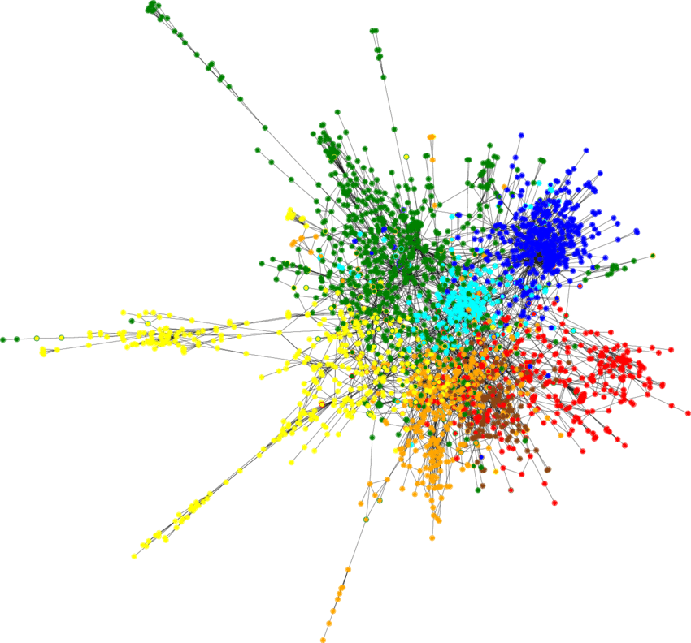

* [Non-Euclidean domains](#non-euclidean-domains)
* [Spectral methods](#spectral-methods)
* [Spatial methods](#spatial-methods)
* [Why spatial is better than spectral](#why-spatial-is-better-than-spectral)
* [Introduction by example: GCN implemented in PyTorch Geometric](#introduction-by-example:-gcn-implemented-in-pytorch-geometric)


I decided to write a series of articles to cover the things I've learned while working on my MEng thesis. My work is focused on applying Geometric Deep Learning methods for shape analysis in the medical setting. The first post is an overview of Geometric Deep Learning.

**Geometric deep learning (GDL)**, a term first proposed by Bronstein et al. [[1]](#references), has emerged aiming to generalize deep learning models to non-Euclidean domains. This novel field in the world of machine learning was successfully used for building recommender systems [[2]](#references), protein function prediction [[3]](#references), fake news detection [[4]](#references), and detection of cancer-beating molecules in food [[5]](#references). GDL owes its success to the fact that it operates directly on the relational structure of a given problem. An example of such a structure is a graph. It can describe various concepts ranging from a social network to a chemical compound.

## Non-Euclidean domains

**Graph.** A graph G is a pair $(V,E)$ with the finite set of vertices $V$ and edges $E$. It captures interactions (edges) between individual units (nodes).

**Manifold.** A manifold is a is a locally Euclidean space. In computer graphics, shapes are represented as discrete 2-dimensional manifolds. A discrete manifold has vertices uniformly sampled from the surface of the manifold with edges expressing the local structure of the shape. It's commonly called a triangular mesh.


## Spectral methods

Spectral methods were the first approach to generalize convolution operation to non-Euclidean domains. In practice, they are rarely used because they are computationally inefficient and don't generalize well to different domains.

Spectral graph convolution draws inspiration from the Euclidean convolution in a spectral domain. The Fourier basis is used to compute spectral convolution in the classical signal processing (Read [this](https://www-structmed.cimr.cam.ac.uk/Course/Convolution/convolution.html) for an in-depth explanation of Convolution theorem). Given a graph, one way to generalize a convolutional architecture is to look at linear operators that commute with the graph Laplacian. This property implies operating on the spectrum of the graph weights, given by the eigenvectors of the graph Laplacian. The concept of graph convolution is explained more in-depth [in here](https://towardsdatascience.com/spectral-graph-convolution-explained-and-implemented-step-by-step-2e495b57f801).

## Spatial methods

Spatial methods are preferred over the spectral methods for [a number of reasons](#why-spatial-is-better-than-spectral). The spatial convolution is considered a more versatile method for learning on non-Euclidean structures. 


*Figure 1: 2D Convolution vs. Graph Convolution.*

Spatial methods define graph convolutions based on a node’s spatial relations, which is analogous to the convolution operation on the classical CNN. Images can be considered a special form of a graph with each pixel representing a node, connected to each neighboring pixels. A filter would be applied on the patch of the image including the pixel and its neighboring nodes. Similarly, spatial methods convolve a given node’s features, using a patch operator, with its neighbors’ features. The intuition about the spatial graph convolutions is that this operation propagates and updates node features along edges.


## Why spatial is better than spectral

Spatial models are preferred over spectral models due to efficiency, generality, and flexibility issues. Spectral models are less efficient than spatial models as they need to perform eigendecomposition or handle the whole graph at the same time (e.g. mesh completion scenario). Spatial models are more scalable to large graphs as they directly perform convolutions in the graph domain via information propagation (i.e. message passing). The computation can be performed in a batch of nodes instead of the whole graph. Moreover, spectral models assume a fixed graph and because they rely on a graph Fourier basis they generalize poorly to new graphs. This is because any perturbation to a graph results in a change of eigenbasis. Spatial models perform graph convolutions locally on each node, which allows for weight sharing across different structures and locations. Finally, spectral methods are limited to undirected graphs whereas spatial methods can handle a bigger variety of graphs such as edge inputs, directed graphs, signed graphs and heterogeneous graphs because of the flexibility of the aggregation function


## Introduction by example: GCN implemented in PyTorch Geometric

**PyTorch Geometric** [[6]](#references) is a geometric deep learning extension library for PyTorch. It is a library for deep learning on irregularly structured input data such as graphs, point clouds, and manifolds, also known as geometric deep learning, from a variety of published papers. It consists of an easy-to-use mini-batch loader for many small and single big graphs, multi gpu-support and a large number of common benchmark datasets.

PyTorch Geometric makes use of Generic Message Passing Scheme to implement any convolutional operator. The message passing scheme consists of 2 steps:
- propagate step - messages from nodes are propagated to their local neighborhoods.
- update step - embedded node's features are updated by the message vector.


**Graph Convolutional Network (GCN)** was defined by Kipf et al. [[7]](#references). The intuition of this method is that it can alleviate the problem of overfitting on local neighborhood structures for graphs with very wide node degree distributions, such as social networks, citation networks, and many other real-world graph datasets. The computational complexity of this approach is $O(n)$. It applies simple filters acting on the 1-hop neighborhood of the graph in the spatial domain. It can be expressed in the generic message-passing scheme as:

$$
\text{msg}(x_i, x_j) =  \frac{1}{\sqrt{\deg(x_i)} \cdot \sqrt{deg(x_j)}} \cdot \left( \mathbf{x}_j\mathbf{\Theta} \right)
$$

$$
\mathbf{x'}_i = \sum_{j \in \mathcal{N}(i) \cup \{ i \}} \text{msg}(x_i, x_j)
$$

where neighboring node features are first transformed by a weight matrix $\mathbf{\Theta}$, normalized by their degree, and finally summed up.
This formula can be divided into the following steps:

1. Add self-loops to the adjacency matrix.
2. Linearly transform node feature matrix.
3. Normalize node features.
4. Sum up neighboring node features.
5. Return new node embeddings.


Pytorch Geometric provides the `MessagePassing` class, all we need to do to implement GCN is write our `update()` and `message()` functions.

```python
class GCNConv(MessagePassing):
    def __init__(self, in_channels, out_channels):
        super(GCNConv, self).__init__(aggr='add')  # "Add" aggregation.
        self.lin = torch.nn.Linear(in_channels, out_channels)

    def forward(self, x, edge_index):
        # x has shape [N, in_channels]
        # edge_index has shape [2, E]

        # Step 1: Add self-loops to the adjacency matrix.
        edge_index = add_self_loops(edge_index, num_nodes=x.size(0))

        # Step 2: Linearly transform node feature matrix.
        x = self.lin(x)

        # Step 3-5: Start propagating messages.
        return self.propagate(edge_index, x=x)

    def message(self, x_j, edge_index, size):
        # x_j has shape [E, out_channels]

        # Step 3: Normalize node features.
        row, col = edge_index
        deg = degree(row, size[0], dtype=x_j.dtype)
        deg_inv_sqrt = deg.pow(-0.5)
        deg_inv_sqrt[deg_inv_sqrt == float('inf')] = 0
        norm = deg_inv_sqrt[row] * deg_inv_sqrt[col]
        return norm.view(-1, 1) * x_j

    def update(self, aggr_out):
        # aggr_out has shape [N, out_channels]

        # Step 5: Return new node embeddings.
        return aggr_out
```

Note: Step 4 is done by setting `aggr='add'` when initialising `GCNConv`.


Wasn't too bad, right? PyTorch Geometric offers implementations of most popular convolutional layers and provides lots of examples. [Check it out on github](https://github.com/rusty1s/pytorch_geometric).

Now we can get our hands dirty on some real-world problem. The Cora dataset consists of 2708 scientific publications classified into one of seven classes. The citation network consists of 5429 links. Each publication in the dataset is described by a 0/1-valued word vector indicating the absence/presence of the corresponding word from the dictionary. We can create a simple model for the semi-supervised classication of each publication in the graph. Our model can be constructed as follows:

```python
class Net(torch.nn.Module):
    def __init__(self):
        super(Net, self).__init__()
        self.conv1 = GCNConv(dataset.num_features, 16)
        self.conv2 = GCNConv(16, dataset.num_classes)


    def forward(self):
        x, edge_index, edge_weight = data.x, data.edge_index, data.edge_attr
        x = F.relu(self.conv1(x, edge_index, edge_weight))
        x = F.dropout(x, training=self.training)
        x = self.conv2(x, edge_index, edge_weight)
        return F.log_softmax(x, dim=1)
```

With just 140 nodes in the training set we are able to achieve $>80%$ classification accuracy for the rest of the nodes, the resulting classified Cora dataset looks as follows:


*Figure 2: Semi-supervised node classification result on Cora dataset.*

***

### References

[1] Bronstein, Michael M., et al. "Geometric deep learning: going beyond euclidean data." IEEE Signal Processing Magazine 34.4 (2017): 18-42.

[2] Monti, Federico, Michael Bronstein, and Xavier Bresson. "Geometric matrix completion with recurrent multi-graph neural networks." Advances in Neural Information Processing Systems. 2017.

[3] Gainza, Pablo, et al. "Deciphering interaction fingerprints from protein molecular surfaces using geometric deep learning." Nature Methods 17.2 (2020): 184-192.

[4] [twitter.com/fabula_ai](https://twitter.com/fabula_ai)

[5] Veselkov, Kirill, et al. "HyperFoods: Machine intelligent mapping of cancer-beating molecules in foods." Scientific reports 9.1 (2019): 1-12.

[6] Kipf, Thomas N., and Max Welling. "Semi-supervised classification with graph convolutional networks." arXiv preprint arXiv:1609.02907 (2016).

[7] Fey, Matthias, and Jan Eric Lenssen. "Fast graph representation learning with PyTorch Geometric." arXiv preprint arXiv:1903.02428 (2019).
